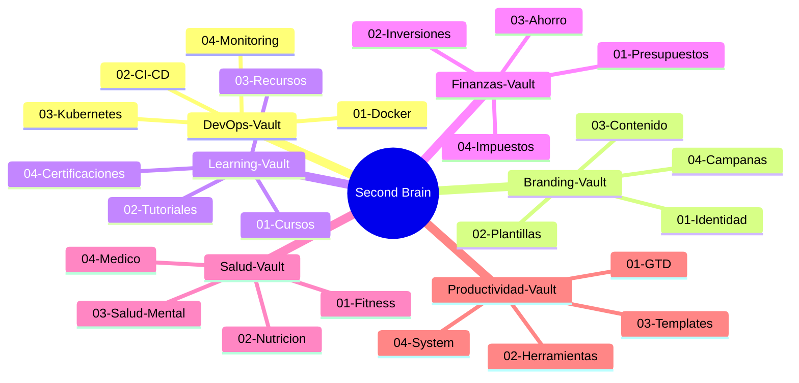

---
title: "Second Brain - Dashboard Maestro"
aliases: [dashboard, master, hub, inicio]
tags: [second-brain, dashboard, master]
created: 2026-06-09
updated: 2026-06-11 03:16
---

# Second Brain - Hub Maestro

> [!info] Centro de control universal
> Este vault conecta y indexa todos tus vaults de Obsidian. Se actualiza automaticamente cuando se crea un vault nuevo.

---

## Estado del Sistema

| Metrica | Valor |
|---------|-------|
| Vaults totales | **6** |
| Total archivos .md | **32** |
| Ultimo scan | 2026-06-10 |
| Auto-update | Activo |
| GitHub | gpb-codes/second-brain-landing |

---

## Vaults Indexados

### DevOps-Vault
> [!tip] Docker, CI/CD, Kubernetes, Monitoring
> Vault con 8 archivos en 4 categorias.

| Metrica | Valor |
|---------|-------|
| Archivos | 8 |
| Carpetas | 4 |
| Tags | docker, kubernetes, github-actions, monitoring |

**Ruta:** `Vaults/DevOps-Vault`

### Branding-Vault
> [!tip] Identidad, Plantillas, Contenido, Campañas
> Vault con 10 archivos en 4 categorias.

| Metrica | Valor |
|---------|-------|
| Archivos | 10 |
| Carpetas | 4 |
| Tags | branding, logo, diseno, marketing |

**Ruta:** `Vaults/Branding-Vault`

### Learning-Vault
> [!tip] Cursos, Tutoriales, Recursos, Certificaciones
> Vault con 12 archivos en 4 categorias.

| Metrica | Valor |
|---------|-------|
| Archivos | 12 |
| Carpetas | 4 |
| Tags | cursos, tutoriales, certifications |

**Ruta:** `Vaults/Learning-Vault`

### Finanzas-Vault
> [!tip] Presupuestos, Inversiones, Ahorro, Impuestos
> Vault con 8 archivos en 4 categorias.

| Metrica | Valor |
|---------|-------|
| Archivos | 8 |
| Carpetas | 4 |
| Tags | finanzas, inversiones, presupuesto |

**Ruta:** `Vaults/Finanzas-Vault`

### Salud-Vault
> [!tip] Fitness, Nutrición, Salud Mental, Médico
> Vault con 10 archivos en 4 categorias.

| Metrica | Valor |
|---------|-------|
| Archivos | 10 |
| Carpetas | 4 |
| Tags | fitness, nutricion, salud, meditacion |

**Ruta:** `Vaults/Salud-Vault`

### Productividad-Vault
> [!tip] GTD, Herramientas, Templates, System
> Vault con 12 archivos en 4 categorias.

| Metrica | Valor |
|---------|-------|
| Archivos | 12 |
| Carpetas | 4 |
| Tags | productividad, gtd, obsidian, zettelkasten |

**Ruta:** `Vaults/Productividad-Vault`

---

## Navegacion Rapida

### Por Tema



---

## Auto-Update

> [!info] Script de sincronizacion
> El script `scripts/update-index.ps1` escanea `D:\vaults` y actualiza este dashboard automaticamente.

```powershell
# Ejecutar manualmente
.\scripts\update-index.ps1
```

---

## Ultima Actualizacion

> [!warning] Auto-sync
> Este archivo se regenera automaticamente.

---

## Referencias

- [[Index]] - Indice detallado de cada vault
- [[Cross-Links]] - Conexiones entre vaults
- [[Meta-Analysis]] - Analisis cruzado
