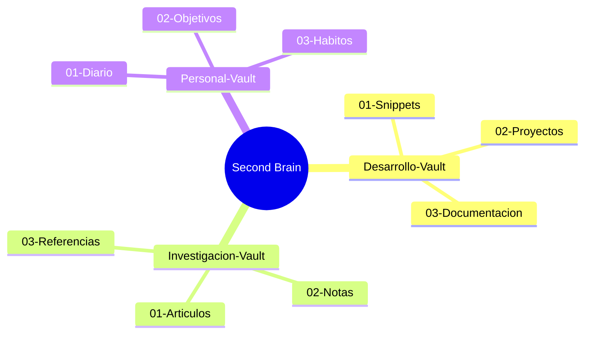

---
title: "Second Brain - Dashboard Maestro"
aliases: [dashboard, master, hub, inicio]
tags: [second-brain, dashboard, master]
created: 2026-06-09
updated: 2026-06-10
---

# Second Brain - Hub Maestro

> [!info] Centro de control universal
> Este vault conecta y indexa todos tus vaults de Obsidian. Se actualiza automaticamente cuando se crea un vault nuevo.

---

## Estado del Sistema

| Metrica | Valor |
|---------|-------|
| Vaults totales | **3** |
| Total archivos .md | **9** |
| Ultimo scan | 2026-06-10 |
| Auto-update | Activo |
| GitHub | gpb-codes/second-brain-landing |

---

## Vaults Indexados

### Desarrollo-Vault
> [!tip] Snippets, Proyectos, Documentacion
> Vault con 3 archivos en 3 categorias.

| Metrica | Valor |
|---------|-------|
| Archivos | 3 |
| Carpetas | 3 |
| Tags | javascript, git, proyectos |

**Ruta:** `Vaults/Desarrollo-Vault`

### Investigacion-Vault
> [!tip] Articulos, Notas, Referencias
> Vault con 3 archivos en 3 categorias.

| Metrica | Valor |
|---------|-------|
| Archivos | 3 |
| Carpetas | 3 |
| Tags | machine-learning, papers, lectura |

**Ruta:** `Vaults/Investigacion-Vault`

### Personal-Vault
> [!tip] Diario, Objetivos, Habitos
> Vault con 3 archivos en 3 categorias.

| Metrica | Valor |
|---------|-------|
| Archivos | 3 |
| Carpetas | 3 |
| Tags | diario, objetivos, habitos |

**Ruta:** `Vaults/Personal-Vault`

---

## Navegacion Rapida

### Por Tema



---

## Auto-Update

> [!info] Script de sincronizacion
> El script `scripts/update-index.ps1` escanea `D:\vaults` y actualiza este dashboard automaticamente.

```powershell
# Ejecutar manualmente
.\scripts\update-index.ps1
```

---

## Ultima Actualizacion

> [!warning] Auto-sync
> Este archivo se regenera automaticamente.

---

## Referencias

- [[Index]] - Indice detallado de cada vault
- [[Cross-Links]] - Conexiones entre vaults
- [[Meta-Analysis]] - Analisis cruzado
