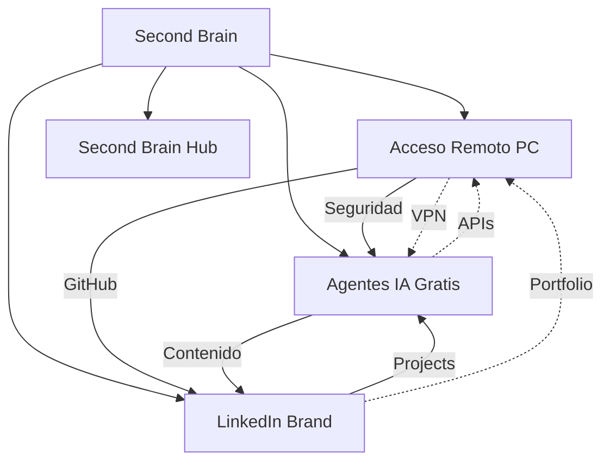

# Cross-Links entre Vaults

> [!info] Conexiones de conocimiento
> Temas que conectan múltiples vaults. El verdadero poder de un Second Brain.

---

## Conexiones Detectadas

### Seguridad ↔ Agentes IA

| Tema | Acceso-Remoto-PC | Agentes-IA-Gratis |
|------|------------------|-------------------|
| Sandbox | VMs para RDP | Docker para agentes |
| Autenticación | Tailscale auth | API keys management |
| Firewall | Reglas de red | Tool permissions |
| Auditorías | Logs de acceso | Agent logging |

> [!tip] Cruce de conocimiento
> Las mejores prácticas de seguridad de [[Acceso-Remoto-PC]] se aplican directamente a la configuración de [[Agentes-IA-Gratis-Vault]].

---

### VPN ↔ Agentes Locales

| Tema | Acceso-Remoto-PC | Agentes-IA-Gratis |
|------|------------------|-------------------|
| Red privada | Tailscale | Ollama local |
| Acceso remoto | RDP over VPN | SSH a servidor de agentes |
| Puertos | Port forwarding | API endpoints |

---

### GitHub ↔ Todos los Vault

| Vault | GitHub Integration |
|-------|-------------------|
| Acceso-Remoto-PC | Repo privado |
| Agentes-IA-Gratis | Repos documentados |
| LinkedIn Brand | Perfil GitHub optimization |
| Second-Brain | Auto-update via GitHub Actions |

---

### Personal Brand ↔ Technical Content

| Tema | LinkedIn Brand | Otros Vaults |
|------|----------------|--------------|
| Contenido técnico | Posts sobre IA | Agentes-IA-Gratis |
| Tutoriales | Carruseles | Acceso-Remoto-PC |
| Portfolio | Proyectos GitHub | Todos los repos |
| Networking | Mensajes | Comunidad de agents |

> [!tip] Crear contenido
> Usa el contenido de Agentes-IA-Gratis para crear posts de LinkedIn. Ejemplo: "Los 5 mejores agentes IA gratuitos en 2026".

---

## Mapa de Conocimiento

---

## Temas Transversales

| Tema | Vault 1 | Vault 2 | Vault 3 |
|------|---------|---------|---------|
| **GitHub** | Repos | Docs | Perfil |
| **Seguridad** | Hardening | Sandbox | - |
| **Docker** | Servidores | Agentes | - |
| **Python** | Scripts | Frameworks | - |
| **Automatización** | RDP | Agentes | Content |

---

## Oportunidades de Conexión

- [ ] Crear post de LinkedIn sobre Agentes IA → usando contenido de Agentes-IA-Gratis
- [ ] Documentar setup de Agentes IA en Acceso-Remoto-PC (VPN + servidor)
- [ ] Usar GitHub de LinkedIn Brand para hostear agentes
- [ ] Crear guía "Cómo montar tu Second Brain" → contenido para LinkedIn

---

## Referencias

- [[Dashboard]] - Panel principal
- [[Index]] - Índice de vaults
- [[Meta-Analysis]] - Análisis cruzado
