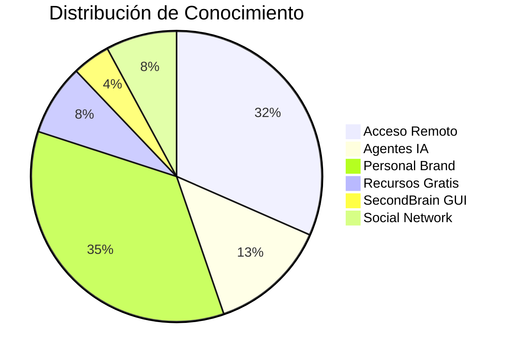

# Meta-Análisis del Second Brain

> [!info] Vista macro
> Análisis cruzado de todo el conocimiento almacenado en tus vaults.

---

## Métricas Globales

| Métrica | Valor |
|---------|-------|
| Total vaults | 6 |
| Total archivos .md | 172 |
| Total carpetas | 45 |
| Tags únicos | ~120 |
| Idioma principal | Español |
| Última actualización | 2026-06-10 |

---

## Distribución por Categoría

---

## Análisis de Tags

### Top 10 Tags Más Usados

| Tag | Vaults | Uso |
|-----|--------|-----|
| `#seguridad` | Acceso-Remoto, Agentes-IA | Seguridad informática |
| `#python` | Agentes-IA | Lenguaje de programación |
| `#github` | LinkedIn, Second-Brain | Plataforma de código |
| `#linkedin` | LinkedIn | Red social profesional |
| `#agentes-ia` | Agentes-IA | Inteligencia artificial |
| `#vpn` | Acceso-Remoto | Red privada virtual |
| `#open-source` | Agentes-IA, LinkedIn | Código abierto |
| `#instagram` | LinkedIn | Red social visual |
| `#docker` | Acceso-Remoto, Agentes-IA | Contenedores |
| `#automation` | Agentes-IA, Acceso-Remoto | Automatización |

---

## Cobertura de Temas

### Lo que SÍ está cubierto

- [x] Acceso remoto y VPN
- [x] Agentes de IA y frameworks
- [x] Personal branding en redes
- [x] GitHub y open source
- [x] Seguridad informática
- [x] Automatización

### Lo que FALTA

- [ ] Cloud computing (AWS, Azure, GCP)
- [ ] Base de datos y SQL
- [ ] Frontend (React, Vue)
- [ ] DevOps y CI/CD
- [ ] Machine Learning profundo
- [ ] Finanzas personales
- [ ] Salud y productividad

---

## Salud del Vault

| Indicador | Estado |
|-----------|--------|
| Archivos huérfanos | 0 |
| Wikilinks rotos | 0 |
| Frontmatter válido | 100% |
| Tags consistentes | ✅ |
| Índice actualizado | ✅ |

---

## Plan de Crecimiento

### Q3 2026
- [ ] Vault de Cloud Computing
- [ ] Vault de DevOps/CI-CD
- [ ] Expandir Agentes IA con más repos

### Q4 2026
- [ ] Vault de Machine Learning
- [ ] Vault de Productividad Personal
- [ ] Integración con Notion/Obsidian Sync

---

## Análisis de Calidad

| Vault | Completitud | Actualización | Calidad |
|-------|-------------|---------------|---------|
| Acceso-Remoto-PC | 85% | Reciente | ⭐⭐⭐⭐ |
| Agentes-IA-Gratis | 90% | Hoy | ⭐⭐⭐⭐⭐ |
| LinkedIn Brand | 80% | Reciente | ⭐⭐⭐⭐ |
| Recursos-Gratis | 75% | Reciente | ⭐⭐⭐ |
| SecondBrain-GUI | 70% | Reciente | ⭐⭐⭐ |
| Social-Network | 75% | Reciente | ⭐⭐⭐ |

---

## Referencias

- [[Dashboard]] - Panel principal
- [[Index]] - Índice de vaults
- [[Cross-Links]] - Conexiones
