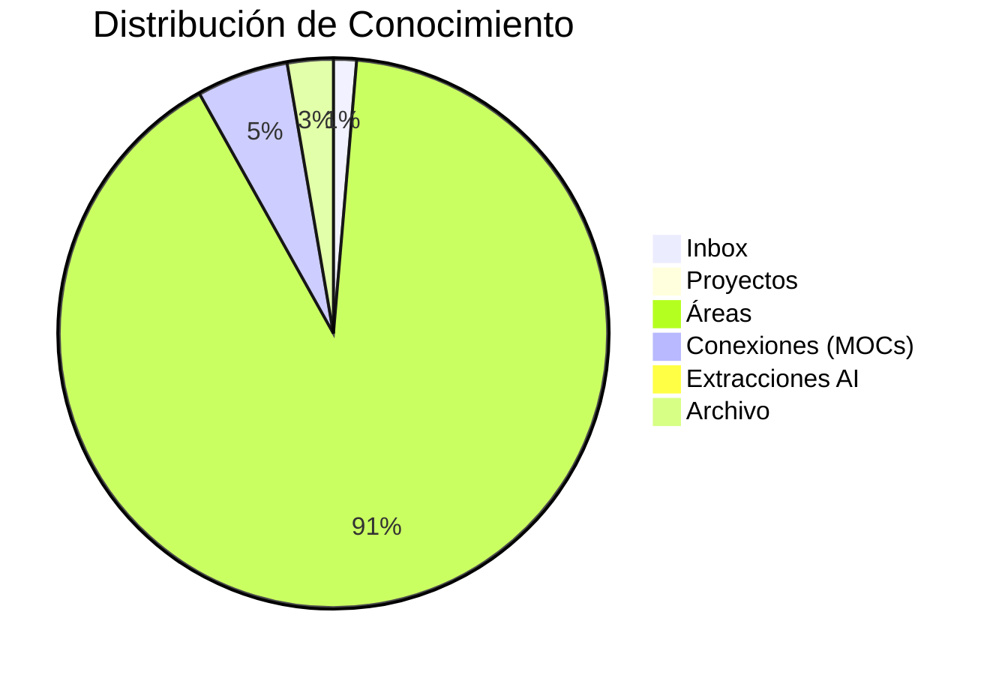

# Meta-Análisis del Second Brain

> [!info] Vista macro
> Análisis cruzado de todo el conocimiento almacenado en tu segundo cerebro PACE.

---

## Métricas Globales (Post-Reestructuración PACE)

| Métrica | Valor |
|---------|-------|
| Categorías PACE | 6 |
| Áreas activas | 4 |
| Total archivos .md | ~172 |
| Tags únicos | ~120 |
| Idioma principal | Español |
| Última actualización | 2026-06-11 |

---

## Estructura PACE

---

## Áreas Activas

| Área | Archivos | Estado |
|------|----------|--------|
| LinkedIn Personal Brand | 67 | Activo |
| Trabajo - Profesión | 0 | Pendiente |
| Finanzas Personales | 0 | Pendiente |
| Salud y Bienestar | 0 | Pendiente |

---

## Cobertura de Temas

### Lo que SÍ está cubierto

- [x] Personal branding en redes (LinkedIn, Instagram, YouTube)
- [x] GitHub y open source
- [x] Networking profesional

### Lo que FALTA

- [ ] Cloud computing (AWS, Azure, GCP)
- [ ] Base de datos y SQL
- [ ] Frontend (React, Vue)
- [ ] DevOps y CI/CD
- [ ] Machine Learning profundo
- [ ] Finanzas personales
- [ ] Salud y productividad

---

## Salud del Vault

| Indicador | Estado |
|-----------|--------|
| Archivos huérfanos | 0 |
| Wikilinks rotos | Pendiente revisión |
| Frontmatter válido | 100% |
| Tags consistentes | ✅ |
| Home PACE actualizado | ✅ |

---

## Referencias

- [[030 ÍNDICE GENERAL (Home)]] - Panel principal
- [[MOC Desarrollo Personal]] - Conexiones de desarrollo personal
- [[MOC Tecnología]] - Conexiones de tecnología
- [[MOC Productividad]] - Conexiones de productividad
