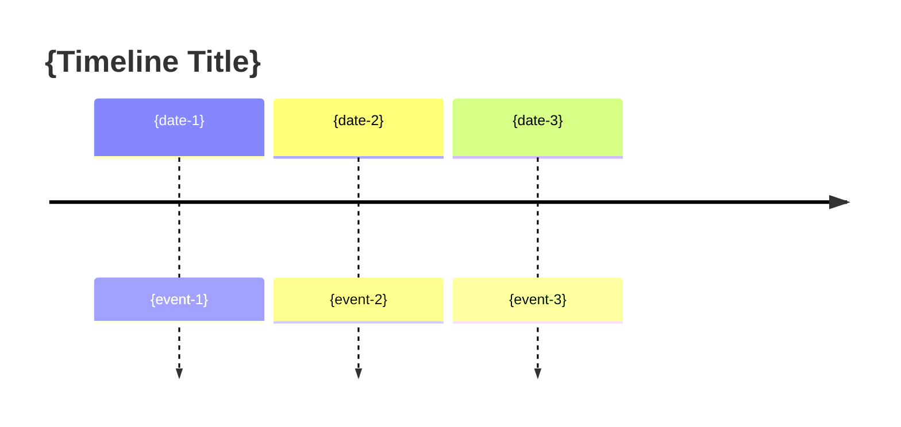

# Timeline Component

## Usage

Insert this component to show history, updates, or chronological events.

## Markdown Version

```markdown
## Timeline

### {date-1}
- {event-1}
- {event-2}

### {date-2}
- {event-3}

### {date-3}
- {event-4}
- {event-5}
- {event-6}
```

## Table Version

```markdown
## Timeline

| Date | Event | Type |
|------|-------|------|
| {date-1} | {event-1} | {type} |
| {date-2} | {event-2} | {type} |
| {date-3} | {event-3} | {type} |
```

## HTML Version (Obsidian)

```html
<div style="margin: 16px 0; padding-left: 20px; border-left: 2px solid var(--background-modifier-border);">
  <div style="margin-bottom: 24px; position: relative;">
    <div style="position: absolute; left: -26px; top: 0; width: 10px; height: 10px; border-radius: 50%; background: {accent-color};"></div>
    <div style="font-weight: bold; color: var(--text-accent); margin-bottom: 4px;">{date-1}</div>
    <div style="color: var(--text-normal);">{event-1}</div>
  </div>
  <div style="margin-bottom: 24px; position: relative;">
    <div style="position: absolute; left: -26px; top: 0; width: 10px; height: 10px; border-radius: 50%; background: {accent-color};"></div>
    <div style="font-weight: bold; color: var(--text-accent); margin-bottom: 4px;">{date-2}</div>
    <div style="color: var(--text-normal);">{event-2}</div>
  </div>
  <div style="margin-bottom: 24px; position: relative;">
    <div style="position: absolute; left: -26px; top: 0; width: 10px; height: 10px; border-radius: 50%; background: {accent-color};"></div>
    <div style="font-weight: bold; color: var(--text-accent); margin-bottom: 4px;">{date-3}</div>
    <div style="color: var(--text-normal);">{event-3}</div>
  </div>
</div>
```

## Mermaid Version



## Parameters

| Parameter | Description | Example |
|-----------|-------------|---------|
| `{date}` | Event date | "2026-06-09" |
| `{event}` | Event description | "Added new feature" |
| `{type}` | Event type (optional) | "update", "release", "bug" |
| `{accent-color}` | Dot color hex | "#7C3AED" |
